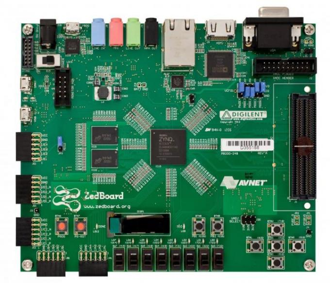

.. zedboard:

Zedboard
########

Overview
********

The Zedboard is a development board designed around the Xilinx Zynq-7000 series
SoC, which features a dual-core 32-Bit ARM Cortex-A9 Processor System (PS)
combined with an Artix-7 series FPGA. Introduced in 2013, the board was designed
by Digilent and is marketed by Avnet.

*Image source: Avnet product website*

Hardware
********

*Notice: peripherals integrated in the Zynq-7000 SoC and other
on-board components which are not supported by Zephyr at the time
being are omitted in the following list.*

- Xilinx XC7Z020-CLG484-1 SoC
- Dual core 32-bit ARM Cortex-A9 CPU Processor System (PS7),
  maximum clock frequency 866 MHz
- Artix-7 series FPGA Programmable Logic (PL) with 74k logic
  cells, 3.3Mb block RAM and 160 DSP slices
- 33 MHz crystal oscillator
- Micron MT41K128M16JT-125 512 MB DDR3 SRAM
- Spansion S25FL256S 256 MB Quad-SPI NOR Flash
- Xilinx PS UART with on-board serial to USB converter (ACM
  serial port) for console and shell use
- 10/100/1000 Xilinx GEM Ethernet Controller connected to a
  GbE capable Marvell 88E1518 Ethernet PHY.
- Two pushbuttons connected to the Zynq's internal GPIO controller
- One LED connected to the Zynq's internal GPIO controller
- Further GPIO inputs and outputs attached to the internal GPIO
  controller can be mapped to individual pins of the board's five
  PMOD expansion ports when building the FPGA bitstream using the
  Xilinx Vivado IDE.
- One reset button
- One FPGA program button
- JTAG pin header
- Integrated JTAG adapter, accessible via a micro-USB interface
  (J17 / PROG)

The following peripherals are usable (activated via a device
tree overlay) if their respective controllers in the form of
IP cores provided by Xilinx have been integrated into the FPGA
bitstream using the Xilinx Vivado IDE:

- 8 switches (Xilinx AXI GPIO controller IP core)
- 8 LEDs (Xilinx AXI GPIO controller IP core)
- 5 pushbuttons (up/down/left/right/center) (Xilinx AXI GPIO
  controller IP core)

Notice that the Xilinx AXI GPIO controller IP core does not support
interrupts for input pins. Therefore, the only interrupt-capable GPIO
inputs on the board are the two pushbuttons attached to the Zynq's
internal GPIO controller (PSGPIO).

Development Workflow
====================

The development workflow for the Zynq-7000 SoC differs somewhat from
that of smaller SoCs which are fully initialized by the respective
device drivers in Zephyr due to its nature as combined processor and
FPGA. The first stage of the boot process on the Zynq, unless when
using an external JTAG debugger, is the execution of the First Stage
Boot Loader (FSBL), which is built by the Xilinx engineering tools
during the implementation of a Zynq-7000 system project. By the time
the execution of the FSBL is complete, the FPGA bitstream has been
programmed into the device, the signals of all enabled peripherals
have been mapped to the device's I/O pins specified in the system
project and the clock sources and frequencies for all enabled
components within the SoC have been set up. Therefore, the clocking
and I/O configuration can be considered valid and complete by the time
Zephyr boots and no clock controller or pinmux drivers are provided
for the Zynq-7000. For peripherals which require an input clock,
the relevant clocking information from the Vivado project must be
reflected in the device tree. This information is required whenever
a peripheral derives a clock frequency at system run-time by means
of programmable prescalers, for example the link speed-dependent
(10/100/1000) Ethernet TX clock or the UART's baud rate generator.
The corresponding peripheral device drivers will calculate and modify
those prescalers at run-time, but the clock source and pinmux
configuration will never be modified. Please refer to the tutorial
linked below on how to configure the SoC and its peripherals within
the Xilinx development tools and how to reflect this configuration
into the board's device tree.

Whenever a Zephyr binary is to be downloaded and debugged using an
external JTAG debugger, the configuration of the Processor System
and the FPGA Programmable Logic otherwise performed by the FSBL
must be performed (for example, using scripted automation) based
on the PS7_init report. This data is provided both in text form
(HTML) or as a tcl script which might be parsed automatically,
depending on the capabilities of the host tools of the used JTAG
debugger. Afterwards, the Zephyr binary may be loaded into RAM
and execution may start at the binary image's entry point.

Supported Features
==================

The zedboard board configuration supports the following hardware
features:

+-----------+--------------+-----------------------------------------+
| Interface | Controller   | Driver/Component                        |
+===========+==============+=========================================+
| GIC-v1    | on-chip      | Generic Interrupt Controller v1 (PL390) |
+-----------+--------------+-----------------------------------------+
| ARM TIMER | on-chip      | ARM Architected Timer                   |
+-----------+--------------+-----------------------------------------+
| UART      | on-chip      | Xilinx PS UART                          |
+-----------+--------------+-----------------------------------------+
| ETHERNET  | on-chip      | Xilinx GEM Ethernet Controller          |
+-----------+--------------+-----------------------------------------+
| GPIO      | on-chip      | Xilinx PS GPIO                          |
+-----------+--------------+-----------------------------------------+
| GPIO      | FPGA IP core | Xilinx AXI GPIO                         |
+-----------+--------------+-----------------------------------------+

The console UART is accessible via the micro-USB port J14 / UART.

Other hardware features are not currently supported by Zephyr.

The default configuration can be found in the Kconfig
:zephyr_file:`boards/arm/zedboard/zedboard_defconfig`.

Boot modes
==========

The following boot modes compatible with Zephyr are supported by the
Zedboard:

- Boot from Quad-SPI NOR Flash
- Boot ELF binary from SD card (with u-boot as additonal boot loader)
- Boot from JTAG

The currently active boot mode of the board is configured using the
jumpers JP7 to JP11.

At the time being, the ``west flash`` build target is not yet supported
for this board. Binaries must be stored in Flash memory using the Xilinx
development tools.

For JTAG download and debugging, either the internal JTAG interface or
an external JTAG debugger can be used. Download and debug via an external
JTAG debugger has been verified to work with the Lauterbach PowerDebug
series debuggers and their TRACE32 frontend.

A tutorial on how to boot a Zephyr binary in each of the supported modes
is provided `here`_.

Board documentation
===================

Technical documents (product brief, hardware user guide, schematics, BOM,
mechanical information, errata etc.) are available from `Avnet's product website`_.

For more information on the capabilities of the Processor System and its
integrated peripherals or the capabilities of the Programmable Logic contained
within the Zynq-7000 SoC, please refer to the `Zynq-7000 All Programmable SoC
Technical Reference Manual`_, Xilinx document ID UG585.

Building
********

Here is an example for the :ref:`blinky-sample` application:

.. zephyr-app-commands::
   :zephyr-app: samples/basic/blinky
   :board: zedboard
   :goals: build

Please refer to the linked tutorial on how to execute the resulting binary
on the Zedboard, depending on the preferred boot mode. Once Zephyr is
running on the board, the LED connected to the internal GPIO controller,
LD9/MIO7 between the OLED display and the pushbuttons BTN8 and BTN9 will
flash.

References
**********

.. target-notes::

.. _here:
   https://github.com/ibirnbaum/zephyr4zedboard-tutorial/blob/main/README.md

.. _Avnet's product website:
   https://www.avnet.com/wps/portal/us/products/avnet-boards/avnet-board-families/zedboard/

.. _Zynq-7000 All Programmable SoC Technical Reference Manual:
   https://docs.xilinx.com/v/u/en-US/ug585-Zynq-7000-TRM
